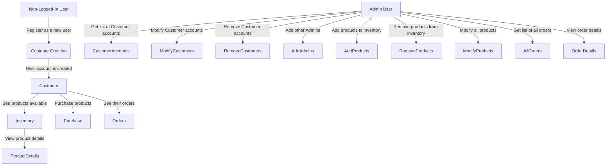
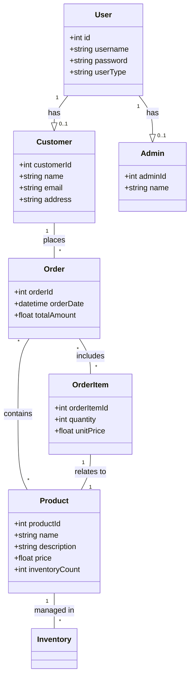

# web-shop

```mermaid
graph TD;
    NonLoggedIn[Non-Logged-In User] -->|Register as a new user| NewUserAccount(CustomerCreation);
    NewUserAccount -->|User account is created| Customer;
    
    Customer -->|See products available| Inventory;
    Inventory -->|View product details| ProductDetails;
    Customer -->|Purchase products| Purchase;
    Customer -->|See their orders| Orders;
    
    Admin[Admin User] -->|Get list of Customer accounts| CustomerAccounts;
    Admin -->|Modify Customer accounts| ModifyCustomers;
    Admin -->|Remove Customer accounts| RemoveCustomers;
    Admin -->|Add other Admins| AddAdmins;
    Admin -->|Add products to inventory| AddProducts;
    Admin -->|Remove products from inventory| RemoveProducts;
    Admin -->|Modify all products| ModifyProducts;
    Admin -->|Get list of all orders| AllOrders;
    Admin -->|View order details| OrderDetails;
```

```mermaid
classDiagram
    class User {
        +int id
        +string username
        +string password
        +string userType
    }

    class Customer {
        +int customerId
        +string name
        +string email
        +string address
    }

    class Order {
        +int orderId
        +datetime orderDate
        +float totalAmount
    }

    class Product {
        +int productId
        +string name
        +string description
        +float price
        +int inventoryCount
    }

    class OrderItem {
        +int orderItemId
        +int quantity
        +float unitPrice
    }

    class Admin {
        +int adminId
        +string name
    }

    User "1" --|> "0..1" Customer : has
    User "1" --|> "0..1" Admin : has
    Customer "1" -- "*" Order : places
    Order "*" -- "*" Product : contains
    Order "*" -- "*" OrderItem : includes
    OrderItem "1" -- "1" Product : relates to
    Product "1" -- "*" Inventory : managed in
```